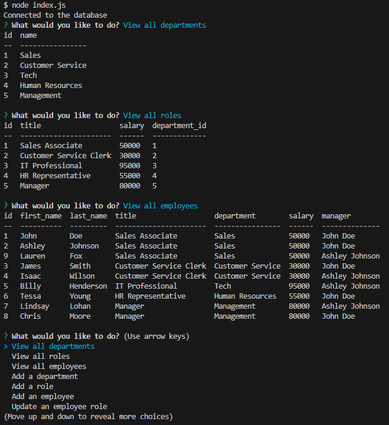

# Employee Tracker
A command-line application that manages a company's employee database, using Node.js, Inquirer, and MySQL.

## Description

This challenge was to create a Node.js command-line application that takes in user input to maintain a company's employee database using MySQL

## Links

- GitHub Repository: https://github.com/blakeedwards3/employee-tracker
- Walkthrough video: https://drive.google.com/file/d/1C0O3N6sFy8puNX14HGRODNTsXe6iRzyX/view

## Installation

Open the integrated terminal and run:
- npm install mysql2
- npm install inquirer
- npm install console.table --save

## Usage

1. Open the terminal in the correct folder and sign into MySQL (mysql -u root -p)
2. Run "source schema.sql"
3. Quit MySQL
4. Run "node index.js"

## Credits

Below is a list of a few webistes I used to help complete the assignment and better understand what the code is doing.
- https://www.npmjs.com/package/console.table
- https://developer.mozilla.org/en-US/docs/Web/API/console/table
- https://levelup.gitconnected.com/database-seeding-in-node-js-2b2eec5bfaa1
- https://gist.github.com/bradtraversy/c831baaad44343cc945e76c2e30927b3
- https://www.w3schools.com/nodejs/nodejs_mysql_select.asp 